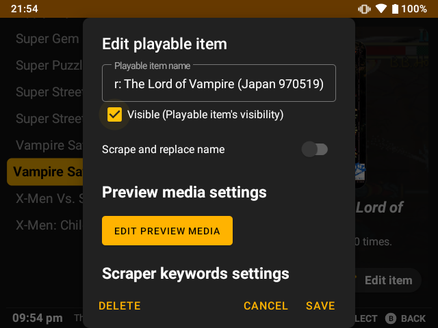
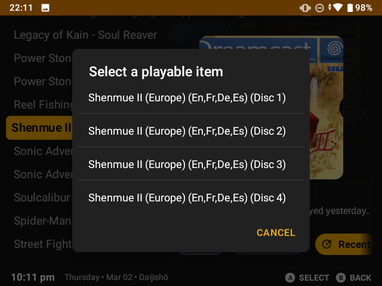
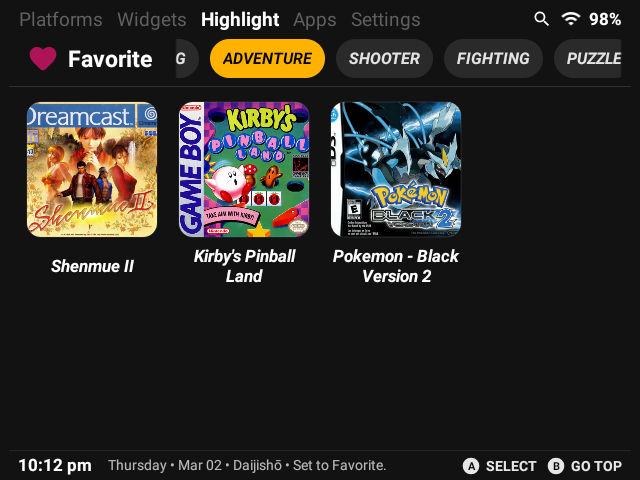
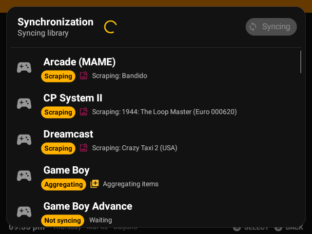
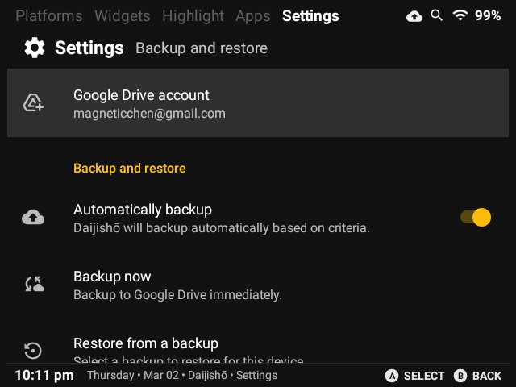
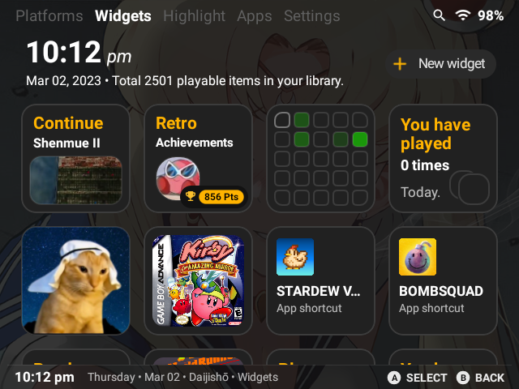
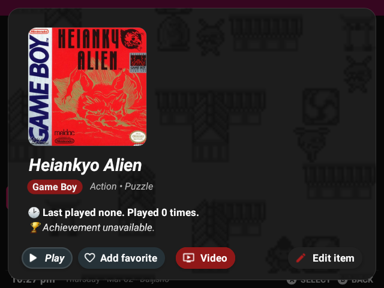
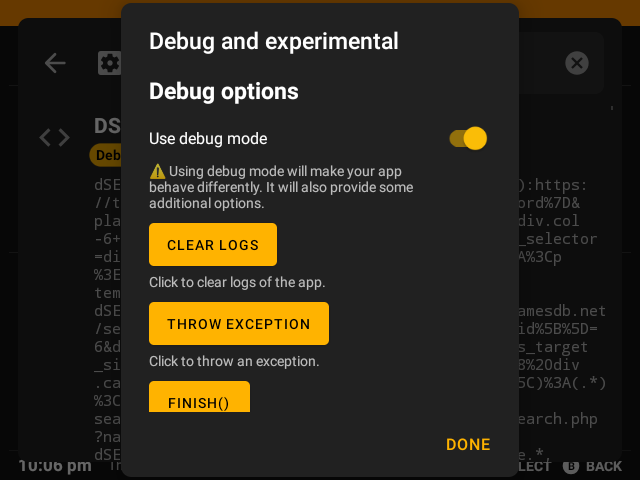
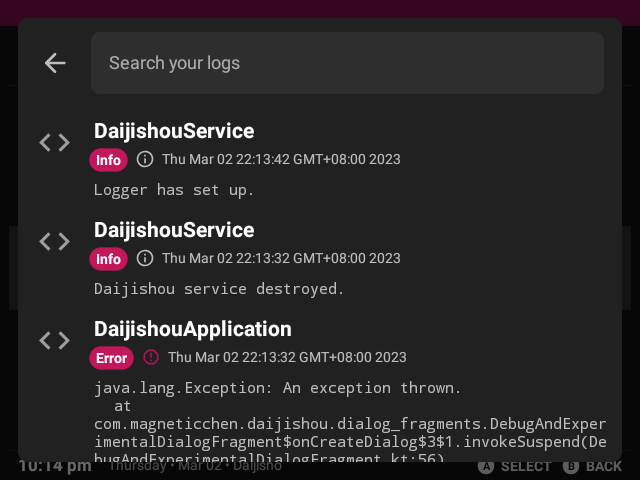
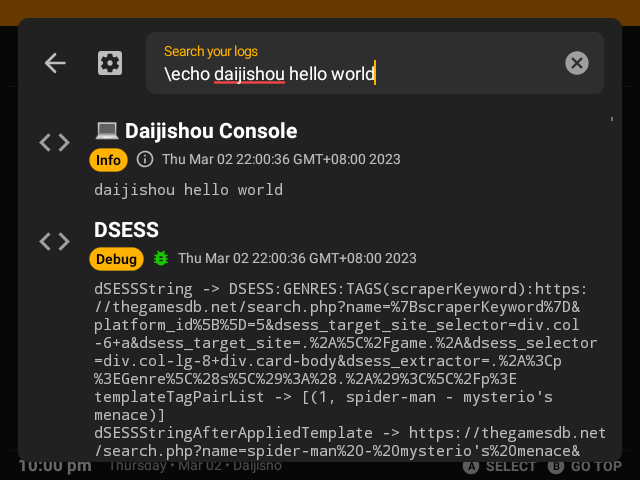

# Daijishou 1.4 (Essential Features Update) Release Note

## Library
### General
 - You can now hide items.

### Disjoint Sets
 - Daijishou will now automatically merge titles.
 - Disks, regions, versions can be merged into single item.

### Genres
 - Daijishou now scrapes genres via DSESS.
 - Highlight page has been renovated for genres.
 - In item detail view, search dialog and list view. Genres will be displayed.

### Synchronization
 - Synchronization architecture and workflow have been unified.
 - Synchronization will now dynamically adjust and limit numbers of concurrent syncs.
 - You can now scrape on a per item basis.
 - You can now sync entire library with one click.
 - Now platforms will be automatically updated via GitHub.
 - You can now import external scraped files like one from Skraper for each platform. 

### Backup And Restore
 - Google Drive APIs have been implemented.
 - Modularized backup and restore components have been introduced.
 - You can now backup Daijishou to Google Drive.
 - Backup data migrations support has been introduced.
 - Restore policy has been introduced.

### DSESS and Libretro Scraper
 - Libretro scraper has been improved for mis-identifying titles. (Like regions and versions)
 - Have improved caching of DSESS.
 - DSESS now can now pretty print reports for developers.
 - DSESS genres support added.
 - Added `scraperKeywordNormalized` template tag.

[See DSESS Documentation](/DSESS.md)
 
## Appearance
### General
 - Relative time format has been introduced.
 - Settings page has been revamped to more refined style.
 - Synchronization now has a dedicated UI.
 - Platforms page UI has been minimized.
 - You can now scale your UI.
 - You can now disable title in platforms page.
 - Fixed RA profile caching.
 - Fixed several bugs.
 - Wallpaper packs thumbnails are displayed in list dialog.

### Wallpaper
 - You can now set your Daijishou wallpaper.
 - The wallpaper will be synced into your backup.
 - Wallpaper API has been introduced for future updates.

### Color Theming
 - Color theming algorithm have been updated. It has been adjusted to avoid awkward colors.
 - Color theming has been applied to item detail view.

## Development
### General
 - Debug mode has been improved. And made public.
 - Thumbnails view for platforms page haven't been succusfully added in 1.4. But can be enable via experimental mode.
 - Daijishou will capture crashes in debug mode.

 

### Logger
 - Logger has been introduced.
 - Logger will show logging records with components, types, timestamps and messages.

 

### Daijishou Console
 - Daijishou Console has been introduced.
 - Several commands have been added.

